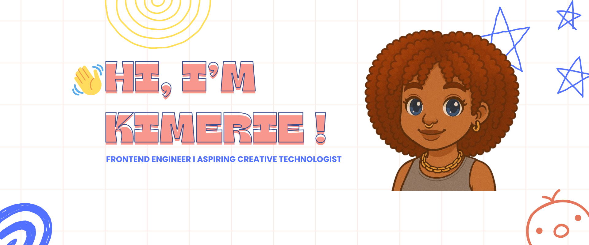

  

👩🏽‍💻 JavaScript • React • Next.js • TypeScript • Motion & UI Design  
📍 Atlanta-based — open to new opportunities (remote, hybrid, or relocation)
---

## 💫 About Me

I’m a frontend engineer who loves building things that make sense to people and are clear, accessible, and grounded in real use.  
From enterprise UIs and clinician tools to little creative experiments, I care about how things work, how they feel, and who they're built for.  
I’m always learning, always iterating, and always aiming to create experiences that are empathetic, intuitive, and thoughtfully made.

---

## 🔭 What I’m Working On

- **🌌 Starby** : a conversational astrology bot built with React, ChatGPT, and Astro. Exploring ideas around intuition, self-reflection, and cosmic play in a single-page app _(currently in progress)_.

---

## 🧑🏽‍🏫 Teaching

- **Teaching Assistant** @ [The Knowledge House](https://www.theknowledgehouse.org/) : supporting students in the [Karim Kharbouch Coding Fellowship](https://www.theknowledgehouse.org/karim_kharbouch_coding_fellowship/), helping youth learn frontend development and grow their confidence in tech.

---

## 🌱 Learning & Exploring

- Combining **code + creativity** for expressive web experiences  
- Playing with **Framer Motion**, **GSAP**, and **Three.js** for animation and 3D interactions  
- Deepening my skills in **UX**, **accessibility**, and **creative coding** workflows  
- Exploring how visual storytelling can shape digital experiences

---

## 💬 Ask Me About

- Building for scale while keeping interfaces intuitive  
- Mentorship, community, and transitioning into tech from non-traditional paths  
- Accessibility and inclusive frontend patterns  
- Turning product ideas into interactive prototypes

---

## ✨ Fun Facts

- 🎧 I DJ and collect vinyl  
- 👟 I love sneakers and will happily talk kicks anytime  
- 🍬 Favorite candy: **Hot Tamales**  
- 🌽 Also love real tamales, especially with green salsa  
- 🍑 I bake when I need to reset — current faves: **peach pie** and **Earl Grey cake**

---

## 🔗 Find Me

---

> _Trying to make the web a little more human._
